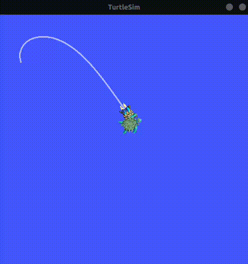

# turtlesim-project

Simple project with turtle simulator, using ros2 nodes, topics, services, parameters and launch files. The `master-turtle` tries to catches all the other turtle that spawns within every 2 seconds. The nodes run in a endless loop and the entire simulation is run using launch file.

### demo

<p align="center">

</p>

## Setup Locally ?

### Pre-requisite

> 1. Ubuntu 22.04 LTS
> 2. ROS2-Humble installed

#### Follow the steps

1. Clone the repository.

```bash
git clone "https://github.com/lonebots/turtlesim-catch-them-all.git"
```

2. Navigate to source folder.

```bash
cd turtlesim-catch-them-all/src
```

3. build the packages.

```bash
colcon build
```

4. run the **launch** file.

```bash
ros2 launch turtlesim_ctall_bringup turtle_ctall_app.launch.py
```
